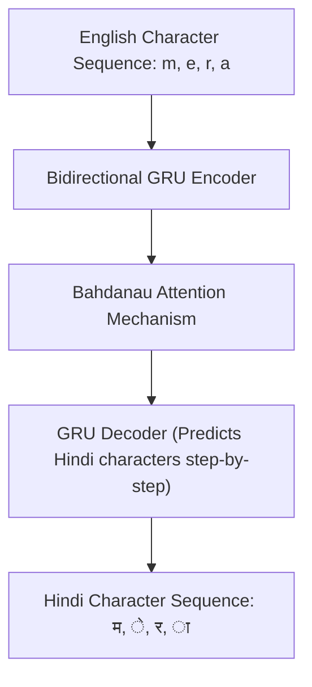

# End-to-End English-to-Hindi Transliteration Engine: Architectural Walkthrough

This document provides a highly thorough, production-grade architectural analysis of our English-to-Hindi Character-Level Transliteration System. It covers **what** was implemented, **how** it works under the hood (line-by-line concept matching), and—most importantly—**why** each architectural choice was made.

---

## 1. The Core Paradigm: Why Seq2Seq for Transliteration?
Transliteration is the process of converting words written in one script (e.g., Roman/Latin letters: `rahul`) into another script based on phonetic similarity (e.g., Devanagari: `राहुल`). 

This is fundamentally a **Sequence-to-Sequence (Seq2Seq)** translation problem, but at the **character level** rather than the word level:
*   **Variable Length Input/Output:** The input string `"sharma"` has 6 characters; the output `"शर्मा"` has 4 Unicode character units. We cannot use a simple 1-to-1 mapping.
*   **Context Dependency:** The letter `a` sounds different in `mera` (ends with a long "aa" sound `ा`) compared to `kal` (contains a short silent "a" sound). The network must look at surrounding characters to decide the correct spelling.

To solve this, we implemented an **Encoder-Decoder Architecture with Bahdanau Attention** in PyTorch.



---

## 2. Deep-Dive: Data Pipeline & The Scrambling Gotcha
Located in: [dataset.py](file:///d:/College/AI/dataset.py)

### The Vocabulary (`class Vocabulary`)
Because neural networks only understand numbers, we map every unique character to an integer index.
We define 4 special control tokens:
*   `<pad>` (0): Padding token to make sequences in a batch the same length.
*   `<sos>` (1): Start of Sequence token to trigger the decoder.
*   `<eos>` (2): End of Sequence token to signal the decoder to stop.
*   `<unk>` (3): Unknown token for characters not seen during training.

### 💡 Why did the "Catastrophic Scrambling" Bug occur?
In our initial implementation of `TransliterationDataset`, duplicate word pairs were removed using Python's `set()`:
```python
self.pairs = list(set(self.pairs))
```
**The Trap:** Python's `set` hashing is randomized on every single script restart for security reasons. This meant the iteration order of `self.pairs` changed completely every time we ran `train.py`. 
Since `Vocabulary` built its `char2idx` dictionary by iterating through `self.pairs`, the characters received **completely random integer IDs** on every run! 

*   *Session 1:* `'a'` was mapped to `5`. The model's embedding layer learned that index `5` represents `'a'`.
*   *Session 2 (Resumed):* `'a'` was randomly mapped to `17`. The model read index `17` expecting some other character and processed pure garbage, causing the loss to immediately shoot from `0.29` to `1.24`.

#### The Fix:
We updated `get_dataloaders()` to check if we are resuming. If `--resume` is True, it **skips building the vocab from the dataset** and instead forces the load of the pristine `source_vocab.json` and `target_vocab.json` directly from the `checkpoints` directory, maintaining perfect index-to-character mapping consistency across runs.

---

## 3. The Model Architecture
Located in: [model.py](file:///d:/College/AI/model.py)

### A. The Encoder (`class Encoder`)
The encoder takes the sequence of English character indices and processes them one by one.

#### Why a Bidirectional GRU?
Standard GRUs only process sequences from left-to-right. However, phonetics depend heavily on both preceding and succeeding letters. For example, in the word `sharma`, the letter `s` combined with `h` makes the "sh" (`श`) sound. A **Bidirectional GRU** runs two independent RNNs:
1.  **Forward RNN:** Processes characters from left-to-right (captures prefix context).
2.  **Backward RNN:** Processes characters from right-to-left (captures suffix context).

Their hidden states are concatenated, providing the decoder with a rich, bidirectional phonetic context for every single character.

#### Why Pack Padded Sequences?
When training in batches, short words must be padded with `<pad>` to match the length of the longest word in the batch. Passing useless padding tokens through the GRU wastes massive GPU cycles and pollutes the hidden state with meaningless padding steps.
We used:
```python
packed_embedded = nn.utils.rnn.pack_padded_sequence(embedded, src_len.cpu(), enforce_sorted=True)
```
This temporarily compresses the tensor, ignoring the pad tokens during the GRU computation, and returns clean, unpolluted hidden states before unpacking them.

---

### B. The Attention Mechanism (`class Attention`)
Not all English letters map directly to Hindi characters. Sometimes, multiple English characters align to a single Hindi character (e.g., `k + h` $\rightarrow$ `ख`). 

We implement **Bahdanau (Additive) Attention**. At each decoding step:
1.  It compares the decoder's current hidden state (what it has translated so far) with all the encoder's outputs (the entire input word).
2.  It outputs an **attention distribution** (probabilities adding up to 1) representing how much focus to place on each input English character.
3.  We apply a mask to prevent the model from focusing on `<pad>` tokens:
    ```python
    attention = attention.masked_fill(mask == 0, -1e4)
    ```
    *Note: We changed this mask penalty from `-1e10` to `-1e4` because `-1e10` was causing float16 underflow/overflow during Mixed Precision training, leading to `NaN` values!*

---

### C. The Decoder (`class Decoder`)
The decoder is a standard GRU, but at each step, it takes three inputs:
1.  The character it predicted in the previous step (e.g., `<sos>` on the first step).
2.  The previous hidden state.
3.  The **Weighted Context Vector** (the sum of the encoder outputs scaled by the attention weights).

It passes these inputs through a fully connected output layer to predict a probability distribution over the entire Hindi vocabulary.

---

## 4. T4 GPU & Mixed Precision (AMP) Optimization
Located in: [train.py](file:///d:/College/AI/train.py)

To maximize training speed and utilize the Tensor Cores on the Google Colab NVIDIA T4 GPU, we implemented **Automatic Mixed Precision (AMP)** using PyTorch's native `torch.amp` API.

### How AMP works:
Standard deep learning models compute everything in 32-bit floating-point numbers (`float32`). AMP automatically performs memory-heavy operations (like matrix multiplications in the GRU and Linear layers) in 16-bit floating-point (`float16`), which is drastically faster and uses half the GPU memory.

```python
with torch.amp.autocast('cuda'):
    output, _ = model(src, src_len, trg)
    loss = criterion(output[1:].view(-1, output.shape[-1]), trg[1:].view(-1))
```

### The Role of the GradScaler:
Because `float16` has a much smaller dynamic range than `float32`, tiny gradients can underflow (become zero). We use a `GradScaler` to scale up the loss before backpropagation, preventing numerical underflow:
```python
scaler.scale(loss).backward()
scaler.step(optimizer)
scaler.update()
```

---

## 5. Checkpoint Resiliency: How `recover.py` Saved the Model
Located in: [recover.py](file:///d:/College/AI/recover.py)

Resuming model training after a crash is not just about reloading the weights; it requires restoring the optimizer state.

### The AdamW Memory Trap:
The AdamW optimizer tracks the moving averages of gradients (momentum). When the model ran on the scrambled vocabulary, the gradients were massive and chaotic, and AdamW memorized this chaos. 

When we manually restored the pristine weights (`best_model.pt`) into the checkpoint but **left the optimizer's state unchanged**, the very first batch of training applied the corrupted momentum to our clean weights, instantly poisoning the model again.

### The Surgical Fix in `recover.py`:
We wrote a specialized script to repair the checkpoint. It:
1.  Injected the pristine model weights from `best_model.pt`.
2.  **Surgically wiped out** the `optimizer_state_dict`, `scheduler_state_dict`, and `scaler_state_dict` keys from the checkpoint.
3.  Rewound the `epoch` counter back to `21` (representing Epoch 22).

When we resumed, the training loop loaded the pristine weights, initialized a completely fresh optimizer state without any corrupted memory, and successfully recovered!

---

## 6. Smart Inference & Decoding Paradigms
Located in: [inference.py](file:///d:/College/AI/inference.py)

### A. Smart Regex Tokenizer
We do not want our model trying to transliterate email addresses, URLs, numbers, emojis, or punctuation.
We created a custom regex tokenization pipeline:
```python
self.token_pattern = re.compile(r'(https?://\S+|www\.\S+|\S+@\S+|\d+|[a-zA-Z]+|\s+|[^\w\s])')
```
During inference, it splits a sentence into tokens and evaluates each token. If a token is a URL, email, number, or standard English single letter (e.g., `I` or `a`), it passes it through unmodified. It only targets actual romanized words for transliteration.

---

### B. Greedy vs. Beam Search Decoding
During inference, the model must predict characters step-by-step. 

#### Greedy Decoding (Simple but Flawed)
At each step, greedy decoding simply picks the character with the absolute highest probability.
*   **The Problem:** If the model makes a sub-optimal guess on the second character, it is locked into a bad spelling path, and the rest of the word will be ruined.

#### Beam Search Decoding (Our Upgrade!)
Instead of keeping only the single best character, Beam Search keeps track of the **top K most likely sequences** (our `beam_size = 3`) at every step.

```
Step 1:  <sos>
             |-- क  (prob: 0.8) -> Keep
             |-- ख  (prob: 0.1) -> Keep
             |-- ग  (prob: 0.05)-> Keep

Step 2:  क
          |-- म  (joint prob: 0.72) -> Keep path: "कम"
          |-- र  (joint prob: 0.65) -> Keep path: "कर"
         ख
          |-- ा  (joint prob: 0.68) -> Keep path: "खा"
         
         (Keep top 3 cumulative paths, discard "ग", proceed...)
```

We apply a **length penalty** to prevent the search from heavily penalizing longer words:
```python
beams = sorted(new_beams, key=lambda x: x[0]/(len(x[1])**0.7), reverse=True)[:beam_size]
```
Beam Search acts as a powerful lookahead algorithm, yielding highly natural spellings and recovering from early character prediction mistakes!

---

## 7. Local Deployment: FastAPI + Streamlit Architecture
Located in: [api.py](file:///d:/College/AI/Project/api.py) & [app.py](file:///d:/College/AI/app.py)

To bring the model into production locally, we split the application into a standard microservices pattern:

```
[User Browser] <---> [Streamlit App (Port 8501)] <---HTTP/JSON---> [FastAPI Server (Port 8000)] <---> [PyTorch Model on CUDA GPU]
```

### The FastAPI Backend (`api.py`)
Exposes two endpoints:
*   `/transliterate/text`: Accepts JSON containing a string, runs inference on local GPU (`cuda`), and returns Devanagari Hindi text.
*   `/transliterate/file`: Accepts a multi-part file upload. It automatically detects `.txt`, `.pdf`, or `.docx` extensions, writes the file to a temp file on disk (to bypass in-memory stream issues), extracts the text, transliterates it, and deletes the temp file.

### The Streamlit Frontend (`app.py`)
Streamlit provides a dynamic dashboard. It allows you to:
1.  Type or paste direct sentences.
2.  Upload full documents, showing a progress spinner while the GPU calculates the transliterations.
3.  Instantly download the output as a `.txt` file containing the perfect Hindi text!
